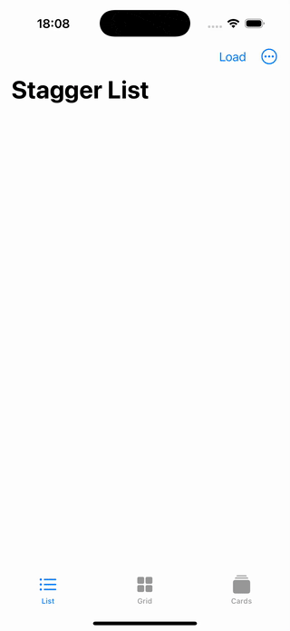
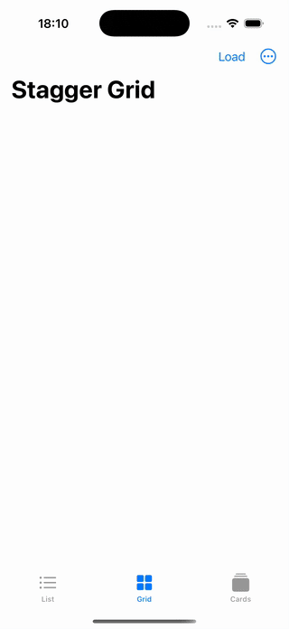
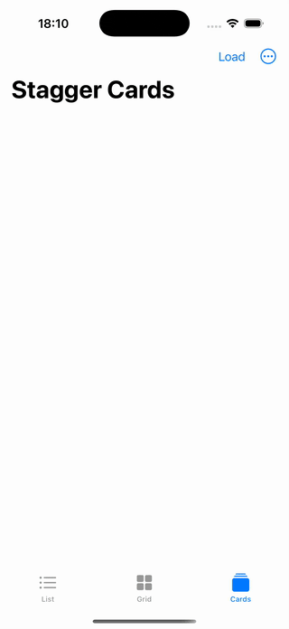

# Stagger

Cascade animations for SwiftUI lists, grids, and collections - without manual delay math.

<p align="leading">
  
  
  
</p>

[](https://swift.org)
[](https://developer.apple.com/ios)
[](https://developer.apple.com/macos)
[](https://developer.apple.com/tvos)
[](https://opensource.org/licenses/MIT)
[](https://swiftpackageindex.com/ivan-magda/swiftui-stagger-animation)

## Quick Start

```swift
VStack {
    ForEach(items) { item in
        ItemView(item: item)
            .stagger()
    }
}
.staggerContainer()
```

That's it. Views animate in sequence with a default opacity transition.

## Why Stagger?

SwiftUI has no native stagger API. The current workaround looks like this:

```swift
// The painful way
ForEach(Array(items.enumerated()), id: \.element.id) { index, item in
    ItemView(item: item)
        .animation(.easeOut.delay(Double(index) * 0.1), value: showItems)
}
```

Problems with this approach:

- Manual index math for every animated collection
- Breaks when views are dynamically inserted/removed
- No completion callbacks
- Empty container views persist after animations

Stagger handles all of this declaratively. One modifier, any transition, automatic coordination.

## Installation

Add to your `Package.swift`:

```swift
dependencies: [
    .package(url: "https://github.com/ivan-magda/swiftui-stagger-animation.git", from: "1.0.0")
]
```

Or in Xcode: File → Add Packages → paste `https://github.com/ivan-magda/swiftui-stagger-animation.git`

## Usage

### Custom Transitions

```swift
Text("Hello")
    .stagger(transition: .move(edge: .leading))

Image(systemName: "star")
    .stagger(transition: .scale.combined(with: .opacity))
```

### Animation Priority

Higher priority values animate first:

```swift
Text("First").stagger(priority: 10)
Text("Second").stagger(priority: 5)
Text("Third").stagger(priority: 0)
```

### Configuration

```swift
.staggerContainer(
    configuration: StaggerConfiguration(
        baseDelay: 0.1,
        animationCurve: .spring(response: 0.5),
        calculationStrategy: .priorityThenPosition(.topToBottom)
    )
)
```

## API Reference

### Calculation Strategies

| Strategy | Behavior |
|----------|----------|
| `.priorityThenPosition(.leftToRight)` | Sort by priority first, then position (default) |
| `.priorityOnly` | Sort by priority only |
| `.positionOnly(.topToBottom)` | Sort by position only |
| `.custom { lhs, rhs in ... }` | Your own sorting logic |

**Position directions:** `.leftToRight`, `.rightToLeft`, `.topToBottom`, `.bottomToTop`

### Animation Curves

| Curve | Usage |
|-------|-------|
| `.default` | System default animation |
| `.easeIn`, `.easeOut`, `.easeInOut` | Standard easing |
| `.spring(response:dampingFraction:)` | Spring physics |
| `.custom(Animation)` | Any SwiftUI animation |

## Full Example

```swift
struct ContentView: View {
    @State private var isVisible = false
    let colors: [Color] = [.red, .orange, .yellow, .green, .blue, .purple]

    var body: some View {
        VStack(spacing: 16) {
            Text("Stagger Demo")
                .font(.largeTitle)
                .stagger(
                    transition: .move(edge: .top).combined(with: .opacity),
                    priority: 10
                )

            LazyVGrid(columns: [GridItem(.adaptive(minimum: 80))], spacing: 16) {
                ForEach(colors.indices, id: \.self) { index in
                    RoundedRectangle(cornerRadius: 12)
                        .fill(colors[index])
                        .frame(height: 80)
                        .stagger(transition: .scale.combined(with: .opacity))
                }
            }

            Button("Toggle") { isVisible.toggle() }
        }
        .padding()
        .staggerContainer(
            configuration: StaggerConfiguration(
                baseDelay: 0.08,
                animationCurve: .spring(response: 0.6)
            )
        )
    }
}
```

## Requirements

| Platform | Minimum Version |
|----------|-----------------|
| iOS | 17.0+ |
| macOS | 14.0+ |
| tvOS | 17.0+ |
| Swift | 6.0+ |
| Xcode | 15.0+ |

## Credits

Based on the [objc.io Swift Talk episode "Staggered Animations Revisited"](https://talk.objc.io/episodes/S01E443-staggered-animations-revisited).

## Contributing

PRs welcome. For major changes, open an issue first.

## License

MIT. See [LICENSE](LICENSE) for details.
